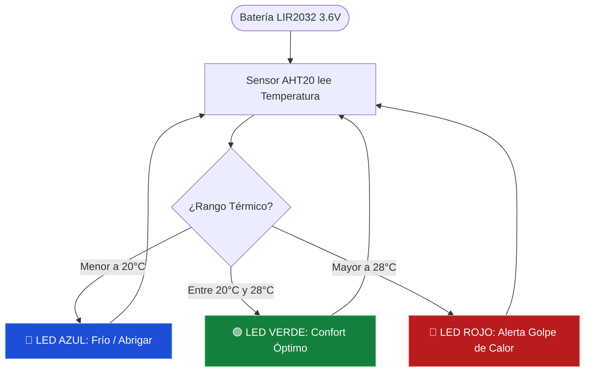

```mermaid
flowchart TD
    A(["Batería LIR2032 3.6V"]) --> B["Sensor AHT20 lee Temperatura"]
    B --> C{"¿Rango Térmico?"}
    C -->|"Menor a 20°C"| D["🔵 LED AZUL: Frío / Abrigar"]
    C -->|"Entre 20°C y 28°C"| E["🟢 LED VERDE: Confort Óptimo"]
    C -->|"Mayor a 28°C"| F["🔴 LED ROJO: Alerta Golpe de Calor"]
    D --> B
    E --> B
    F --> B

    style D fill:#1d4ed8,stroke:#93c5fd,color:#ffffff
    style E fill:#15803d,stroke:#86efac,color:#ffffff
    style F fill:#b91c1c,stroke:#fca5a5,color:#ffffff
```

