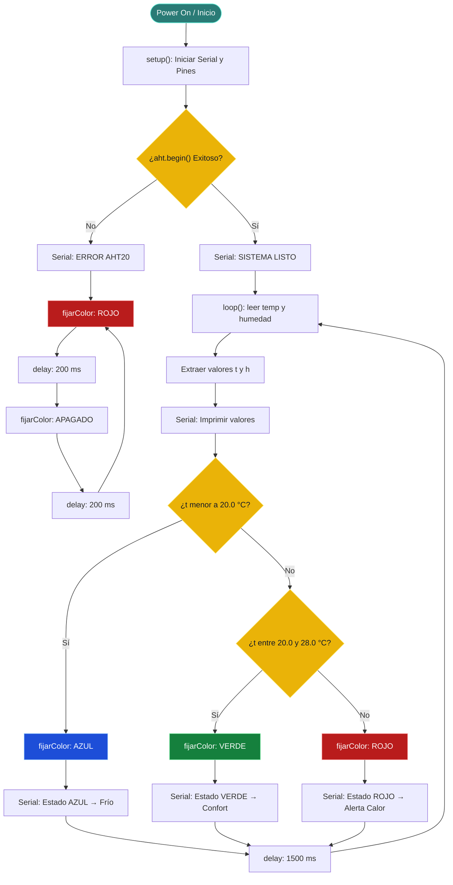

```mermaid
flowchart TD
    Inicio(["Power On / Inicio"]) --> Setup["setup(): Iniciar Serial y Pines"]
    Setup --> CheckAHT{"¿aht.begin() Exitoso?"}

    %% Rama No: Bucle de error del sensor
    CheckAHT -->|"No"| Err1["Serial: ERROR AHT20"]
    Err1 --> Err2["fijarColor: ROJO"]
    Err2 --> Err3["delay: 200 ms"]
    Err3 --> Err4["fijarColor: APAGADO"]
    Err4 --> Err5["delay: 200 ms"]
    Err5 --> Err2

    %% Rama Sí: Funcionamiento normal del sistema
    CheckAHT -->|"Sí"| Ready["Serial: SISTEMA LISTO"]
    Ready --> Loop["loop(): leer temp y humedad"]
    Loop --> Extract["Extraer valores t y h"]
    Extract --> PrintVal["Serial: Imprimir valores"]
    PrintVal --> CheckCold{"¿t menor a 20.0 °C?"}

    %% Estado Frío (< 20.0 °C)
    CheckCold -->|"Sí"| ColdLED["fijarColor: AZUL"]
    ColdLED --> ColdSer["Serial: Estado AZUL → Frío"]
    ColdSer --> DelayLoop

    %% Evaluación de Confort o Alerta de Calor
    CheckCold -->|"No"| CheckComfort{"¿t entre 20.0 y 28.0 °C?"}

    %% Estado Confort (20.0 - 28.0 °C)
    CheckComfort -->|"Sí"| ComfLED["fijarColor: VERDE"]
    ComfLED --> ComfSer["Serial: Estado VERDE → Confort"]
    ComfSer --> DelayLoop

    %% Estado Alerta Calor (> 28.0 °C)
    CheckComfort -->|"No"| HotLED["fijarColor: ROJO"]
    HotLED --> HotSer["Serial: Estado ROJO → Alerta Calor"]
    HotSer --> DelayLoop

    %% Cierre y repetición del ciclo principal
    DelayLoop["delay: 1500 ms"] --> Loop

    %% Estilos de color
    style Inicio fill:#2a7b76,stroke:#5eead4,color:#ffffff
    style CheckAHT fill:#eab308,stroke:#fef08a,color:#111827
    style CheckCold fill:#eab308,stroke:#fef08a,color:#111827
    style CheckComfort fill:#eab308,stroke:#fef08a,color:#111827
    style Err2 fill:#b91c1c,stroke:#fca5a5,color:#ffffff
    style ColdLED fill:#1d4ed8,stroke:#93c5fd,color:#ffffff
    style ComfLED fill:#15803d,stroke:#86efac,color:#ffffff
    style HotLED fill:#b91c1c,stroke:#fca5a5,color:#ffffff
```
